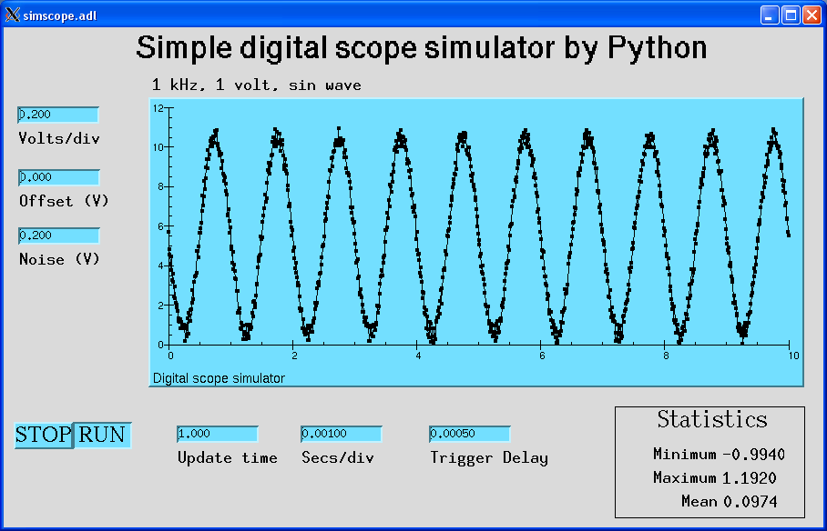

.. _tutorials-label:

Tutorial
========

.. py:currentmodule:: pcaspy

Example 1: Expose some random number(s)
---------------------------------------
Define PV database
^^^^^^^^^^^^^^^^^^
Suppose we want to have one PV returning a random number, we define it like this::

    prefix = 'MTEST:'
    pvdb = {
        'RAND' : {
            'prec' : 3,
        },
    }

``pvdb`` is a plain Python :class:`dict`, in which keys are PV base names and values are their configurations, a dict also.
In this case we specify that the PV has base name ``RAND`` and 3 digits precision. 
``prefix`` will be the prefixed to the PV base names and create the PV ``MTEST:RAND``. 

Refer to :ref:`database-field-definition` about full description of database definition.

Dummy server
^^^^^^^^^^^^
Here is the source code `dummy.py <https://github.com/paulscherrerinstitute/pcaspy/blob/master/example/dummy.py>`_.

Our first attempt is to implement a server so it blindly accepts any value written and gives it back upon request.
Two classes are required,::

    from pcaspy import SimpleServer, Driver

:class:`Driver` class is the base class that connects channel access requests with real world data source.
The base class implementation simply stores the value written by user and retrieves upon request.
All the derived class does is to call base class's :meth:`Driver.__init__` to ensure proper setup.::

    class myDriver(Driver):
        def __init__(self):
            super(myDriver, self).__init__()

:class:`SimpleServer` is the class that responds to channel access requests.
We would never need to modify it. We only need to instantiate it.::

    if __name__ == '__main__':
        server = SimpleServer()

And create all PVs based on ``prefix`` and ``pvdb`` definition.::

        server.createPV(prefix, pvdb)
        driver = myDriver()

In the end we start the processing loop.::

        while True:
            # process CA transactions
            server.process(0.1)

Now try some caget/caput,::

    $ caput MTEST:RAND 0
    Old : MTEST:RAND                           2
    New : MTEST:RAND                           0
    $ caput MTEST:RAND -1.23
    Old : MTEST:RAND                           0
    New : MTEST:RAND                           -1.23
    $ caget MTEST:RAND
    MTEST:RAND                           -1.23

Notice that the procedure to instantiate server, PVs and driver remains identical afterwards. 
So later we will not show this part.

Return a random number
^^^^^^^^^^^^^^^^^^^^^^
It is not much interesting to be just an echo. We would return a random number upon every read request.
We need to override `read` method in our subclass `myDriver`.::

    import random
    class myDriver(Driver):
        def __init__(self):
            super(myDriver, self).__init__()

        def read(self, reason):
            if reason == 'RAND':
                value = random.random()
            else:
                value = self.getParam(reason)
            return value

.. note::

   * :meth:`Driver.__init__` must be called **before** using any :meth:`Driver.getParam` :meth:`Driver.setParam` calls.
   * The ``read`` method accepts one parameter ``reason`` and it is the PV base name as defined in ``pvdb``. 
     In this function, we return a random number when ``RAND`` is being read.

Scan periodically
^^^^^^^^^^^^^^^^^
Until now this PV updates only when clients read. It can also update itself periodically if we define the *scan* field,::

    pvdb = {
        'RAND' : {
            'prec' : 3,
            'scan' : 1,
        },
    }

Now the PV will update every second. Monitor the change,::

    $ camonitor MTEST:RAND
    MTEST:RAND                     2011-07-19 12:32:06.574775 0.646198
    MTEST:RAND                     2011-07-19 12:32:07.574704 0.872313
    MTEST:RAND                     2011-07-19 12:32:08.581681 0.171537
    MTEST:RAND                     2011-07-19 12:32:09.581581 0.351235

.. note::
  * The scan thread is implemented per PV and the scan interval can be arbitrary. In comparison the EPICS database scan thread is implemented per IOC and scan interval is defined in database definition.

Return a series of random number
^^^^^^^^^^^^^^^^^^^^^^^^^^^^^^^^
Suppose we want to return more random numbers, 10 e.g. Add *count* field in ``pvdb``,::

    pvdb = {
        'RAND' : {
            'prec' : 3,
            'scan' : 1,
            'count': 10,
        },
    }

We modify the ``read`` method to return a list of 10 random numbers,::

        ...
        if reason == 'RAND':
            return [random.random() for i in range(10)]
        ...

Here is the final source code `get_random.py <https://github.com/paulscherrerinstitute/pcaspy/blob/master/example/get_random.py>`_

Remark
~~~~~~
This first demo shows the basics of how to configure PV attributes and respond to read access.
One thing to emphasise is that :meth:`Driver.read` is called each time a ca_get request comes in.
In a realistic application, the PV values are normally polled, in a periodical or triggered way,
from external sources. As so the PV values will be stored in a parameter cache (:meth:`Driver.setParam`) at the point of being fetched.
The derived driver does not need to override :meth:`Driver.read`.
The values are simply fetched from the parameter cache (:meth:`Driver.getParam`).
This principle is followed by all the following examples.

.. _shell-command-example:

Example 2: Interface to any shell command
-----------------------------------------
Here is the full source code `pysh.py <https://github.com/paulscherrerinstitute/pcaspy/blob/master/example/pysh.py>`_

Define PV database
^^^^^^^^^^^^^^^^^^
Suppose we want to run a shell command and publish its results as an EPICS channel.::

    prefix = 'MTEST:'
    pvdb = { 
        'COMMAND' : {
            'type' : 'string',
        },
        'OUTPUT'  : {
            'type' : 'string',
        },
        'STATUS'  : {
            'type' : 'enum',
            'enums': ['DONE', 'BUSY']
        },
        'ERROR'   : {
            'type' : 'string',
        },
    }

``MTEST:COMMAND`` contains the command to execute. Its output will be stored in ``MTEST:OUTPUT``.
Its possible error will be stored in ``MTEST:ERROR``. 
``MTEST:STATUS`` indicates whether the command finishes running or not.

Implement myDriver
^^^^^^^^^^^^^^^^^^
We do the normal inheritance of ``Driver``,::

    import thread
    import subprocess
    import shlex

    from pcaspy import Driver, SimpleServer

    class myDriver(Driver):
        def __init__(self, server):
            Driver.__init__(self, server)
            # shell execution thread id
            self.tid = None

In this driver, readout is done through the default implementation of Driver, which retrieves the value with :meth:`Driver.getParam`.
So we will not override :meth:`Driver.read`.

``write`` method
^^^^^^^^^^^^^^^^
In the ``write`` method, we only respond to the write request of ``MTEST:COMMAND``.
If there is no command running, we spawn a new thread to run the command in ``runShell``.::

        def write(self, reason, value):
            status = True
            if reason == 'COMMAND':
                if not self.tid:
                    command = value
                    self.tid = thread.start_new_thread(self.runShell,(command,))
                else:
                    status = False
            else:
                status = False
            # store the values
            if status:
                self.setParam(reason, value)

            return status

.. note::
  * Portable channel access server is single threaded so we should avoid blocking the ``write`` method by any means. 
    In this case we run the command in a new thread.
  * We have limited the running command to one. Until the running thread finishes, ``status = False`` is returned
    to refuse further requests and the client may see a put failure.
  * We assign ``status = False`` to refuse change requests of ``OUTPUT``, ``ERROR`` and ``STATUS``.
    This makes them effectively read-only.

Execution thread
^^^^^^^^^^^^^^^^
In our command execution thread, we run the command with :mod:`subprocess` module.
The subprocess's *stdout* and *stderr* outputs are redirected to channel ``MTEST:OUTPUT`` and ``MTEST:ERROR``.
Upon exception ``MTEST:ERROR`` has the exception message.

Before and after command execution we update ``MTEST:STATUS`` channel. We call :meth:`Driver.updatePVs` to inform clients about PV value change.::

        def runShell(self, command):
            # set status BUSY
            self.setParam('STATUS', 1)
            self.updatePVs()
            # run shell
            try:
                proc = subprocess.Popen(shlex.split(command), 
                        stdout = subprocess.PIPE, 
                        stderr = subprocess.PIPE)
                proc.wait()
            except OSError, m:
                self.setParam('ERROR', str(m))
                self.setParam('OUTPUT', '')
            else:
                self.setParam('ERROR', proc.stderr.read().rstrip())
                self.setParam('OUTPUT', proc.stdout.read().rstrip())
            # set status DONE
            self.setParam('STATUS', 0)
            self.updatePVs()
            self.tid = None

Now we can run some commands to see the output,::

    $ caput MTEST:COMMAND "whoami"
    Old : MTEST:COMMAND
    New : MTEST:COMMAND            whoami
    $ caget MTEST:OUTPUT
    MTEST:OUTPUT                   wang_x1

Make it asynchronous
^^^^^^^^^^^^^^^^^^^^
As we have noted, the command normally would take undetermined time to finish running. In addition to yield ``MTEST:STATUS`` to indicate completion.
We could make ``MTEST:COMMAND`` asynchronous, and notify upon completion if client has called *ca_array_put_callback*.

Add a new field *asyn* to ``COMMAND`` to indicate that this PV finishes writing asynchronously,::

        'COMMAND' : {
            'type' : 'string',
            'asyn' : True
        },

In thread `runShell`, we call :meth:`Driver.callbackPV` to notify the processing is done.::

            # run shell
            ...
            self.callbackPV('COMMAND')
            # set status DONE

Now run it again and notice the delay,::

    $ caput -w 10 -c MTEST:COMMAND "sleep 5"
    Old : MTEST:COMMAND                  whoami
    New : MTEST:COMMAND                  sleep 5

.. _simscope-example:

Example 3: A Simulated Oscilloscope
-----------------------------------
Until now the driver principles have all been introduced by these two trivial examples. 
I cannot find more realistic examples, so I port this
`asynPortDriver example <http://www.aps.anl.gov/epics/modules/soft/asyn/R4-12/asynPortDriver.html>`_.
Its intention is stated clearly by Mark Rivers,

  This example is a simple digital oscilloscope emulator. In this example all of output control and input data
  is done in a calculated simulation. But it is easy to see how to use the driver as a basis for real device control.
  The code doing the simulation would simply be changed to talk to an actual device.

The python version in PCASpy is `simscope.py <https://github.com/paulscherrerinstitute/pcaspy/blob/master/example/simscope.py>`_.
To best check how it functions, launch the medm panel,::

    medm -x -macro P=MTEST simscope.adl

.. note::
  * The value passed to ``setParam`` could be Python builtin types: str, float, int, list, tuple or numpy data types: int8/16/32, float32/64, ndarray. 

.. py:currentmodule:: pcaspy.tools

Example 4: Integrate into GUI applications
------------------------------------------
In the above examples, the server process loop is running in the main thread.
GUI applications require their own event loop running in the main thread also.
In such application the server process loop could run in a separate thread and yield the main thread to the GUI event loop.

A helper class :class:`ServerThread` can be used to execute the server in a separate thread.

The following runs the server for ~4 seconds and exits. The debug output shows the server process.::

    import time
    from pcaspy import SimpleServer
    from pcaspy.tools import ServerThread
    server = SimpleServer()
    server.setDebugLevel(4)
    server_thread = ServerThread(server)
    server_thread.start()
    time.sleep(4)
    server_thread.stop()

.. py:currentmodule:: pcaspy

Qt GUI integration
^^^^^^^^^^^^^^^^^^
`qtgui.py <https://github.com/paulscherrerinstitute/pcaspy/blob/master/example/qtgui.py>`_ shows how to combine it with Qt GUI event loop.

Example 5: Access Security Control
----------------------------------
We already could refuse user written values in ``write`` method as done in Example 3.
In addition it is possible to use access security rules as in EPICS database. 

Define the access security rule 
^^^^^^^^^^^^^^^^^^^^^^^^^^^^^^^
Suppose PV ``MTEST:LEVEL`` indicates the liquid nitrogen level and PV ``MTEST:FILL`` is the commanded amount of liquid nitrogen to refill. 
We want to refuse user's filling request when level is above 5.::

    # test.as
    # Access security rules 
    ASG(fill) {
        INPA($(P)LEVEL)
        RULE(1, READ)
        RULE(1, WRITE){
            CALC("A<5")
        }
    }

It defines a rule *fill*, which grants read access but limits write access to ``$(P)LEVEL`` below 5.
Refer to `EPICS Application Developer's Guide <http://www.aps.anl.gov/epics/base/R3-14/12-docs/AppDevGuide/node9.html>`_
about details.

Use security rules
^^^^^^^^^^^^^^^^^^
In the database, ``MTEST:FILL`` has field *asg* set to the defined access rule *fill*.::

    prefix = 'MTEST:'
    pvdb = {
        'LEVEL': {},
        'FILL' : {'asg'  : 'fill',},
    }

Before PVs are created, the access rules defined in the first step must be activated,::

        ...
        server = SimpleServer()
        server.initAccessSecurityFile('test.as', P=prefix)
        server.createPV(prefix, pvdb)
        ...

Test
^^^^
::

    $ caput MTEST:LEVEL 2
    Old : MTEST:LEVEL                    0
    New : MTEST:LEVEL                    2

    $ caput MTEST:FILL 5
    Old : MTEST:FILL                     0
    New : MTEST:FILL                     5

    $ caput MTEST:LEVEL 6
    Old : MTEST:LEVEL                    2
    New : MTEST:LEVEL                    6

    $ caput MTEST:FILL 8
    Old : MTEST:FILL                     5
    New : MTEST:FILL                     5

    $ cainfo MTEST:FILL
    MTEST:FILL
        State:            connected
        Host:             slslc06.psi.ch:5064
        Access:           read, no write
        Native data type: DBF_DOUBLE
        Request type:     DBR_DOUBLE
        Element count:    1

.. py:currentmodule:: pcaspy

Other Tips
==========
Hold string having more than 40 characters
------------------------------------------
``string`` type is limited to 40 characters (at least in EPICS 3.14). To overcome this limit, use ``char`` type::

        'STATUS' : {
            'type': 'char',
            'count' : 300,
            'value' : 'some initial message. but it can become very long.'
        }

Later in the driver application, it can be accessed just like string parameter, e.g.::

    self.setParam('STATUS', 'an error is happened')
    print self.getParam('STATUS')

Alarm status and severity
-------------------------
* For numerical type, the fields *lolo*, *low*, *high*, *hihi* determine the alarm status and severity::

        'VOLTAGE' : {
            'hihi' : 10,
            'high' :  5,
            'low'  : -5,
            'lolo' :-10
        }

* For enumerate type, the fields *states* determine the alarm status::

        'STATUS' : {
            'type' : 'enum',
            'enums':  ['OK', 'ERROR'],
            'states': [Severity.NO_ALARM, Severity.MAJOR_ALARM]
        }

* For string type, the alarm status and severity can be changed by :meth:`Driver.setParamStatus`.

Check out the reference :meth:`Driver.setParam` and :meth:`Driver.setParamStatus`,
and `alarm severity example <https://github.com/paulscherrerinstitute/pcaspy/blob/master/example/alarm_severity.py>`_.

Dynamic properties
------------------
For enumerate type, the choices are specified by field *enums* at startup. If in case the choices should be changed
at runtime, :meth:`Driver.setParamEnums` can be used. For numerical type, the precision, units, limits can also be changed
by :meth:`Driver.setParamInfo`. Check out the
`dynamic enums example <https://github.com/paulscherrerinstitute/pcaspy/blob/master/example/dynamic_property.py>`_.

To see the effect, use the following script: ::

  import time
  from CaChannel import ca, CaChannel

  def monitor_callback(epics_arg, user_arg):
      if epics_arg['type'] == ca.DBR_CTRL_DOUBLE:
          print('units:', epics_arg['pv_units'])
      elif epics_arg['type'] == ca.DBR_CTRL_ENUM:
          print('enums:', epics_arg['pv_statestrings'])

  enum = CaChannel('MTEST:ENUM')
  enum.searchw()
  enum.add_masked_array_event(ca.DBR_CTRL_ENUM, None, ca.DBE_PROPERTY, monitor_callback)

  rand = CaChannel('MTEST:RAND')
  rand.searchw()
  rand.add_masked_array_event(ca.DBR_CTRL_DOUBLE, None, ca.DBE_PROPERTY, monitor_callback)
  rand.flush_io()

  while True:
      time.sleep(1)

Now try to change the enum state and of MTEST:ENUM and units of MTEST:RAND. ::

  $ caput MTEST:CHANGE 4
  $ caput MTEST:RAND.EGU 'eV'

The script shall have the following output. ::

  enums: ('ZERO', 'ONE')
  units:
  enums: ('ZERO', 'ONE', 'TWO', 'THREE')
  units: eV

Create PVs using different prefix
---------------------------------
Suppose one would want to create PVs with different prefix, maybe to distinguish their subsystem.
It turns out to be quite easy, call :meth:`SimpleServer.createPV` for each of them.::

    prefix1='MTEST-1'
    pvdb1={
    'SIGNAL1': {},
    }
    prefix2='MTEST-2'
    pvdb2={
    'SIGNAL2': {},
    }
    ...
        server.createPV(prefix1, pvdb1)
        server.createPV(prefix2, pvdb2)

Note however that the PV base name must not be the same, because :class:`Driver` class uses PV base name as its identity.
